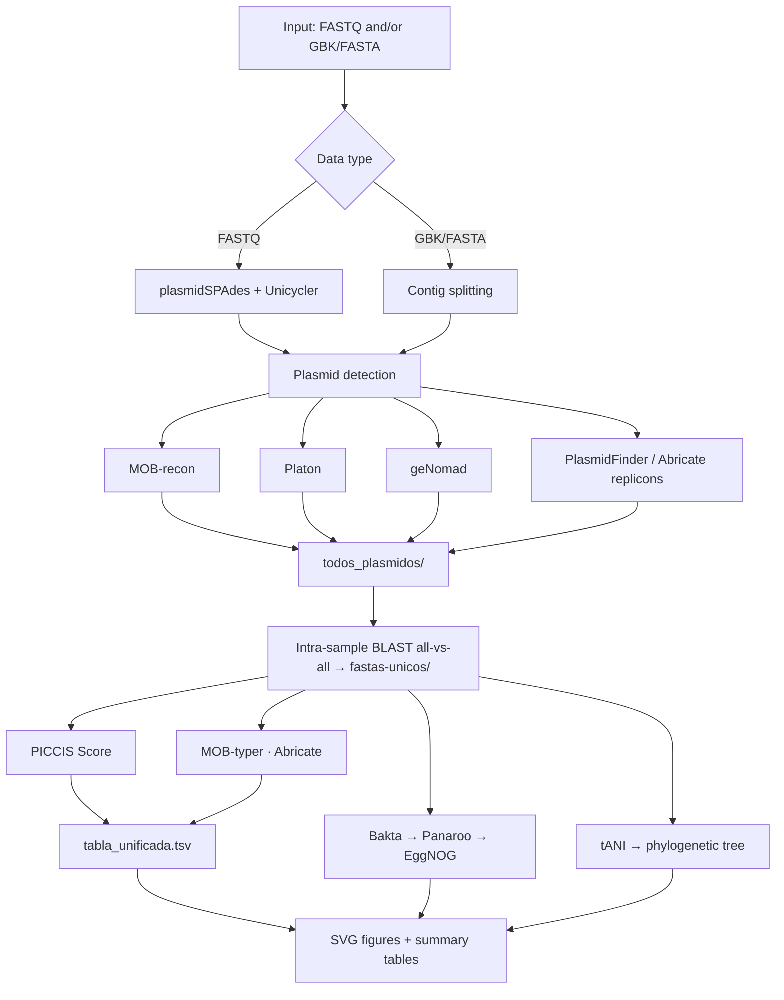

<!-- Language: **English** | [Español](README.es.md) -->

# PICCIS v2.0

**P**lasmid **I**dentification, **C**lustering and **C**omparative **I**ntegrated **S**core

PICCIS is a reproducible pipeline for the **identification, deduplication, annotation, and comparative analysis of plasmids** from raw sequencing reads (FASTQ) and/or assembled genomes (GenBank/FASTA). It integrates several complementary plasmid-detection tools under a consensus scheme, computes a per-plasmid **PICCIS Score** of detection reliability, and produces a unified results table together with a set of publication-ready figures and phylogenetic trees.

> **Language:** English · [Versión en español](README.es.md)

---

## Table of Contents

- [Overview](#overview)
- [Pipeline Architecture](#pipeline-architecture)
- [System Requirements](#system-requirements)
- [Installation](#installation)
  - [Quick Install](#quick-install)
  - [1. Clone the Repository](#1-clone-the-repository)
  - [2. Create the Conda Environments](#2-create-the-conda-environments)
  - [3. Download the Databases](#3-download-the-databases)
  - [4. Verify the Installation](#4-verify-the-installation)
- [Conda Environments](#conda-environments)
- [Databases](#databases)
- [Usage](#usage)
  - [Interactive Mode](#interactive-mode)
  - [Command-Line Arguments](#command-line-arguments)
  - [Input File Naming Conventions](#input-file-naming-conventions)
  - [Examples](#examples)
  - [Metadata File](#metadata-file)
- [Pipeline Stages in Detail](#pipeline-stages-in-detail)
  - [Parallel Execution Model](#parallel-execution-model)
  - [Assembly](#assembly)
  - [Plasmid Detection](#plasmid-detection)
  - [Intra-Sample Deduplication](#intra-sample-deduplication)
  - [Annotation](#annotation)
  - [Phylogeny](#phylogeny)
- [Output Structure](#output-structure)
- [PICCIS Score](#piccis-score)
- [Figures and Tables](#figures-and-tables)
- [Integrated Tools](#integrated-tools)
- [Troubleshooting](#troubleshooting)
- [Citation](#citation)
- [License](#license)

---

## Overview

PICCIS addresses a central problem in plasmid genomics: no single tool reliably recovers all plasmids, and different tools disagree on which contigs are plasmidic. Rather than depending on one method, PICCIS runs multiple independent detectors, reconciles their predictions through an all-versus-all BLAST deduplication performed **within each biological sample**, and reports a transparent reliability score reflecting how many independent tools support each plasmid.

Principal features:

- **Flexible input.** Accepts raw FASTQ reads, assembled GenBank/FASTA genomes, or both in a single run.
- **Consensus detection.** Combines plasmidSPAdes, Unicycler with MOB-recon, Platon, geNomad, and PlasmidFinder/Abricate.
- **Intra-sample deduplication.** An all-versus-all BLAST collapses redundant predictions per sample and transfers detector evidence to the retained representative.
- **PICCIS Score.** A reproducible per-plasmid reliability value between 0.0 and 1.0, derived from the number of independent tools that detect each plasmid.
- **Comprehensive annotation.** Structural and functional annotation with Bakta, pangenome analysis with Panaroo, COG/GO annotation with EggNOG-mapper, and mobility/replicon typing with MOB-typer.
- **Phylogenetics.** Total ANI distance matrix and a bootstrap-supported tree via tANI_tool.
- **Visualization.** Approximately thirteen vector (SVG) figures plus summary tables, including an optional geographic map.
- **Resumable and parallel.** Checkpoints allow interrupted runs to resume; the degree of parallelism is controlled by `--cores` or the `PICCIS_WORKERS` environment variable.

---

## Pipeline Architecture



The pipeline proceeds through six stages:

1. **Input.** FASTQ reads and/or assembled GenBank/FASTA files.
2. **Assembly.** plasmidSPAdes (`--plasmid` / `--metaplasmid`) and Unicycler.
3. **Detection.** MOB-recon, Platon, geNomad, and PlasmidFinder/Abricate contribute candidate plasmids to `todos_plasmidos/`.
4. **Deduplication.** An all-versus-all BLAST performed independently within each sample collapses redundant predictions into `fastas-unicos/`.
5. **Annotation and scoring.** MOB-typer, Abricate, Bakta, Panaroo, and EggNOG-mapper annotate the non-redundant plasmids; the PICCIS Score is computed from detector consensus.
6. **Comparative analysis.** tANI generates the distance matrix and tree, and all results are consolidated into `tabla_unificada.tsv` and the figures in `graficos/`.

---

## System Requirements

| Requirement | Detail |
|---|---|
| Operating system | Linux x86-64 (tested on Ubuntu) |
| Package manager | [Conda](https://docs.conda.io) or Miniconda; `mamba` recommended (installed automatically if absent) |
| Memory | 16 GB RAM or more recommended (geNomad and Bakta are the most demanding stages) |
| Disk | Approximately 25–40 GB for environments and databases (the full EggNOG database alone is ~14 GB) |
| Network | Required to create environments and download databases |
| `git` | Required; the `tANI_tool` repository is cloned during installation and is needed at run time |

---

## Installation

Installation consists of three ordered steps: creating the conda environments, downloading the databases, and verifying the result.

### Quick Install

```bash
git clone <your-repository-URL> PICCIS
cd PICCIS
bash install.sh                 # conda environments + R packages + clones tANI_tool
conda activate plasmidos_env
bash install_databases.sh       # downloads all databases (including geNomad)
bash check_piccis.sh            # verifies the installation
```

Each step is described in detail below.

### 1. Clone the Repository

```bash
git clone <your-repository-URL> PICCIS
cd PICCIS
```

The repository must contain the following structure:

```
PICCIS/
├── piccis_pipeline.py
├── requirements.txt              # pip dependencies for plasmidos_env
├── install.sh
├── install_databases.sh
├── install_r_packages_tani.R
├── check_piccis.sh
└── envs/
    ├── plasmidos_env.yml
    ├── spades_env.yml
    ├── unicycler_env.yml
    ├── platon_env.yml
    ├── mob_env.yml
    ├── panaroo_env.yml
    ├── bakta_env.yml
    ├── abricate_env.yml
    ├── genomad_env.yml
    ├── tani_env.yml
    └── eggnog_env.yml
```

> The `*_env.yml` files must reside inside the `envs/` directory. If they are in the repository root, move them with `mkdir -p envs && mv *_env.yml envs/`.

### 2. Create the Conda Environments

```bash
bash install.sh
```

This script installs `mamba` into the `base` environment if it is not present, creates `plasmidos_env` (Python 3.10) with `blast=2.12`, `plasmidfinder`, `perl`, `git`, and the pip dependencies listed in `requirements.txt`, creates the ten remaining environments from `envs/*.yml`, verifies that each tool is available, installs the R packages required by tANI (`install_r_packages_tani.R`), and clones the `tANI_tool` repository into the PICCIS directory.

### 3. Download the Databases

```bash
conda activate plasmidos_env
bash install_databases.sh
```

The script downloads (and skips any that already exist) the Abricate databases (resfinder, card, vfdb), the Bakta light database (~1.3 GB) together with the AMRFinderPlus database, the Platon database (~1.8 GB), the geNomad database (~1.6 GB), the PlasmidFinder database (initialized automatically), and optionally the EggNOG-mapper database (full ~14 GB, annotation-only ~6 GB, or skipped). All resulting paths are written to `piccis.conf` so that the pipeline reads them automatically.

### 4. Verify the Installation

```bash
bash check_piccis.sh
```

This verification script inspects the conda environments, tools, Python libraries, R packages, the `tANI_tool` repository, and every database. It prints a summary with `OK / WARN / MISSING` counts and returns exit code `0` when no errors are found. Any **MISSING** item must be resolved before running the pipeline; **WARN** items are optional (for example, EggNOG operating in remote mode or the geographic map being disabled).

---

## Conda Environments

PICCIS relies on isolated environments because the dependencies of several tools are mutually incompatible (for instance, SPAdes 4.x conflicts with `blast=2.12`).

| Environment | Tool(s) | Role in the pipeline |
|---|---|---|
| `plasmidos_env` | blastn, plasmidfinder.py, perl, git, Python libraries | Primary environment; runs the pipeline and the deduplication BLAST |
| `spades_env` | spades.py | Plasmid assembly (plasmidSPAdes) |
| `unicycler_env` | unicycler | Assembly used by MOB-recon, Platon, and geNomad |
| `platon_env` | platon | Per-contig plasmid detection |
| `mob_env` | mob_recon, mob_typer | Mobility reconstruction and replicon typing |
| `genomad_env` | genomad | Machine-learning plasmid classification |
| `abricate_env` | abricate | Resistance/virulence genes and replicon detection |
| `bakta_env` | bakta | Structural and functional annotation |
| `panaroo_env` | panaroo | Pangenome / presence–absence matrix |
| `eggnog_env` | emapper.py | COG/GO functional annotation |
| `tani_env` | Rscript and R packages | tANI distance matrix and phylogenetic tree |

---

## Databases

| Database | Approx. size | Key in `piccis.conf` | Required |
|---|---|---|---|
| Bakta (light) + AMRFinderPlus | ~1.3 GB | `BAKTA_DB` | Yes |
| Platon | ~1.8 GB | `PLATON_DB` | Yes |
| geNomad | ~1.6 GB | `GENOMAD_DB` | Yes |
| Abricate (resfinder/card/vfdb) | < 1 GB | — (self-managed) | Yes |
| PlasmidFinder | small | — (auto-downloaded) | Yes |
| EggNOG-mapper | ~6–14 GB | `EGGNOG_DB` | Optional* |

\* If `EGGNOG_DB` is not configured, EggNOG operates in **remote mode**, which requires an internet connection and is slower.

The `piccis.conf` file is generated automatically and has the following form:

```ini
# PICCIS v2.0 - Database configuration
BAKTA_DB=/home/user/databases/piccis/bakta_db/db-light
PLATON_DB=/home/user/databases/piccis/platon_db
GENOMAD_DB=/home/user/databases/piccis/genomad_db/genomad_db
EGGNOG_DB=/home/user/databases/piccis/eggnog_db
```

If the databases are relocated, edit this file and the pipeline will use the updated paths. When a path is missing or invalid, the pipeline prompts for it interactively.

---

## Usage

```bash
conda activate plasmidos_env
python piccis_pipeline.py [options]
```

### Interactive Mode

When invoked without arguments, the pipeline guides the user step by step, prompting for the working directory, input type, data folders, library type, and metadata:

```bash
python piccis_pipeline.py
```

### Command-Line Arguments

| Argument | Values | Description |
|---|---|---|
| `--cores N` | integer | Number of parallel workers. Defaults to `cpu_count() - 1`. Use `1` for debugging. |
| `--workdir DIR` | path | Working directory where all results are written. |
| `--tipo {1,2,3}` | 1/2/3 | Input type: `1` = FASTQ, `2` = GBK/FASTA, `3` = both. |
| `--fastq-dir DIR` | path | Folder containing the FASTQ files. |
| `--gbk-dir DIR` | path | Folder (or file) containing GBK/FASTA assemblies. |
| `--library {1..5}` | 1–5 | SPAdes library type (see [Input File Naming Conventions](#input-file-naming-conventions)). |
| `--metagenomic` | flag | Enables `--metaplasmid` in SPAdes for metagenomic data. |
| `--metadata TSV` | path | Metadata file (sample, Niche, Especie, Pais). |

The number of workers is resolved with the following precedence: `--cores N`, then the `PICCIS_WORKERS=N` environment variable, then `cpu_count() - 1`.

### Input File Naming Conventions

For FASTQ input, file names must follow the conventions below so that the pipeline can pair reads and associate them with the correct sample.

| Library (`--library`) | Expected files |
|---|---|
| 1 — Paired-end Illumina | `<sample>_R1.fastq[.gz]` and `<sample>_R2.fastq[.gz]` (the `_1` / `_2` suffixes are also accepted) |
| 2 — Single-end | `<sample>.fastq[.gz]` |
| 3 — IonTorrent | `<sample>.fastq[.gz]` |
| 4 — Paired-end + PacBio CLR | paired files as above, plus `<sample>_pb.fastq` |
| 5 — Paired-end + Nanopore | paired files as above, plus `<sample>_np.fastq` |

Internally, every reconstructed plasmid is renamed using a double-underscore convention that records both its sample of origin and the tool that produced it:

```
<sample>__<tool>__<original_name>.fasta
```

For example, `HST74__spades__component_3.fasta` or `HST74__mob_recon__AB123.fasta`. The double underscore (`__`) separates the source-sample name from the method, which allows the deduplication step to group predictions correctly regardless of their origin. Sample names are normalized so that dots become hyphens (for example, `NZ_CP090643.1` becomes `NZ_CP090643-1`) and spaces become underscores, while hyphens are preserved as meaningful separators.

### Examples

```bash
# Fully interactive
python piccis_pipeline.py

# Paired-end FASTQ, 8 cores, with metadata, non-interactive
python piccis_pipeline.py \
    --workdir run1_results \
    --tipo 1 \
    --fastq-dir data/fastq \
    --library 1 \
    --metadata metadata.tsv \
    --cores 8

# Assembled GBK/FASTA only
python piccis_pipeline.py --tipo 2 --gbk-dir data/genbank --cores 4

# Metagenomic data (single core, for debugging)
python piccis_pipeline.py --tipo 1 --fastq-dir data/fastq \
    --library 1 --metagenomic --cores 1
```

### Metadata File

The metadata file is optional but recommended: it enriches the unified table and enables the per-niche, per-species, and per-country figures. It is a CSV or TSV file containing at least the following columns.

| Column | Example | Use |
|---|---|---|
| `sample` | `HST74` | Must match the input strain name (without extension) |
| `Niche` | `Environment` / `Clinic` / `Undetermined` | Coloring and per-niche figures |
| `Especie` | `Klebsiella pneumoniae` | Per-species figures |
| `Pais` | `Argentina` | Geographic map (world map) |

The value in `sample` must correspond to the input file name without its extension. The pipeline normalizes hyphens and underscores when matching names across tools.

---

## Pipeline Stages in Detail

### Parallel Execution Model

Independent tasks are dispatched with a `ProcessPoolExecutor`, which uses real operating-system processes rather than threads. This choice avoids Python's global interpreter lock and suits the bioinformatic tools, which are CPU-bound and frequently launch their own subprocesses. Each worker inherits the parent process environment (including `PATH` and the active conda environment) without additional configuration. When the number of workers is set to one, tasks run serially, which simplifies debugging. Results are returned in completion order rather than submission order.

### Assembly

For FASTQ input, plasmidSPAdes is executed once per sample. The official SPAdes documentation advises against running plasmidSPAdes on more than one library simultaneously, so each sample is processed independently. The total number of threads is distributed across samples as `max(1, total_threads // n_workers)` threads per sample. For metagenomic data, the `--metaplasmid` mode is used. In parallel, Unicycler produces a complete assembly per sample, which serves as input for MOB-recon, Platon, and geNomad.

### Plasmid Detection

Several independent detectors contribute candidate plasmids to `todos_plasmidos/`:

- **plasmidSPAdes** reconstructs plasmid components directly from reads.
- **MOB-recon** reconstructs plasmids from the Unicycler assembly.
- **Platon** classifies individual contigs as plasmidic.
- **geNomad** applies a machine-learning classifier to the assembly.
- **Abricate/PlasmidFinder** searches complete assemblies for replicon sequences. For each hit, the exact replicon region is extracted using its start–end coordinates and written to `unicycler-replicons/` so that it enters the deduplication BLAST as an independent line of evidence (the `ABRICATE-REPLICON` detector).

### Intra-Sample Deduplication

Deduplication is performed **strictly within each biological sample**; sequences from different samples are never compared. For each sample, all FASTA files produced by its tools are collected and compared with an all-versus-all BLAST. Two sequences are considered redundant when they share at least 95% identity over at least 95% coverage, where coverage is taken as the maximum of the query and subject coverage. When two sequences are redundant, the longer one is retained and the shorter is discarded; the retained representative inherits the detector evidence of the discarded sequence. The surviving sequences populate `fastas-unicos/`, so each sample contributes its non-redundant plasmids independently. The default identity and coverage thresholds are both 95%.

### Annotation

Non-redundant plasmids are annotated by several tools. MOB-typer assigns mobility class and replicon/relaxase types. Abricate is run against resfinder, card, vfdb, and plasmidfinder in parallel; the PlasmidFinder database accessed through Abricate is generally more current than the standalone tool. Bakta performs structural and functional annotation, producing the GFF3, FAA, and GBFF files that feed Panaroo and EggNOG; because Bakta 1.5.x lacks a `--force` option, an existing output directory containing a `.gff3` file is skipped, while an incomplete one is removed and recomputed. Panaroo builds the pangenome and the presence–absence matrix; GFF3 files are sanitized to remove genes with internal stop codons that Panaroo would reject, files without genes are filtered out, and at least two valid GFF3 files are required. EggNOG-mapper provides COG/GO annotation, operating in local mode when a database is configured or in remote server mode otherwise.

### Phylogeny

tANI_tool computes the total ANI distance matrix and a bootstrap-supported tree. The tool maintains its own internal checkpoint files (`setup.log`, `original_calculations.log`, and `blast_database.log`) that record the genome names processed in a previous run. If the set of input files changes between runs—for example, after duplicates are removed—these checkpoints would reference files that no longer exist and the tool would loop indefinitely searching for them. PICCIS therefore clears these internal checkpoints together with the distance matrix whenever the input set has changed.

---

## Output Structure

Within the working directory (`--workdir`), the pipeline creates, among others:

```
<workdir>/
├── todos_plasmidos/            # All candidate plasmids from every detector
├── fastas-unicos/              # Non-redundant plasmids (after BLAST)
├── plasmidos_analizados/       # Stable backup of fastas-unicos/
├── FASTQ-plasmid/              # Raw plasmidSPAdes output
├── FASTQ-unicycler/            # Unicycler assemblies
├── MOB-recon-plasmid/          # MOB-recon results (FASTQ branch)
├── GBK-FASTA-plasmid/          # Split contigs from GBK/FASTA
├── MOB-recon-gbk/              # MOB-recon results (GBK branch)
├── unicycler-replicons/        # Replicon regions extracted by Abricate
├── genomad_out/                # geNomad results
├── panaroo_out/                # Pangenome
├── resultados-blast-resumido.tsv
├── piccis_score.tsv            # Per-plasmid score
├── tabla_unificada.tsv         # ★ Main results table
├── componentes_y_clusters.csv  # SVD + KMeans
├── tablas_resumen/             # Summary tables
└── graficos/                   # All figures in SVG format
```

The central output is **`tabla_unificada.tsv`**, which combines detection evidence, metadata, mobility, size, GC content, and the PICCIS Score for each plasmid.

---

## PICCIS Score

The PICCIS Score quantifies the **reliability of each plasmid** according to how many independent tools detected it.

- Each detection tool contributes either `0` or `1` per plasmid.
- The detectors considered are **plasmidSPAdes, MOB-recon, geNomad, Platon, and PlasmidFinder/Abricate** (including the `ABRICATE-REPLICON` evidence).
- The summarized all-versus-all BLAST transfers detector evidence: when two sequences are deduplicated (that is, identified as the same plasmid), the retained representative inherits the detectors of the discarded sequence.
- **Score = (number of tools that detect the plasmid) / (number of available tools)**, yielding a value between 0.0 and 1.0.

A plasmid detected **only** by geNomad and matching no other detector in the BLAST is treated as unconfirmed and removed before the unified table is built, which reduces false positives. The score and its reliability label are incorporated into `tabla_unificada.tsv` and visualized in the PICCIS Score figure.

---

## Figures and Tables

All figures are written as scalable vector graphics (SVG) in `graficos/`:

| Figure | Content |
|---|---|
| PICCIS Score | Detector heatmap and per-plasmid score |
| Niche | Distribution by niche (Environment / Clinic / Undetermined) |
| Description | Counts by descriptive category |
| Size | Distribution of plasmid sizes |
| Size vs GC | Scatter of size against GC content |
| GC by niche | GC content broken down by niche |
| Mobility (pie) | Proportion of conjugative / mobilizable / non-mobilizable |
| Mobilizable types | Relaxase / MOB types |
| Conjugative types | Conjugation systems |
| World map | Geographic distribution by country *(requires geopandas/geopy and metadata)* |
| COG | COG functional categories (EggNOG) |
| SVD + KMeans | Pangenome clustering (Panaroo) |
| Tree + heatmap | tANI tree with presence–absence heatmap |

The PICCIS Score figure comprises two panels: a detection heatmap, in which each row is a plasmid and each column a tool (green for detected, red for not detected, grey for unavailable), and a panel of horizontal bars ordered by score and colored by reliability level (high, medium, low, or no data). In addition, `tablas_resumen/` contains tabulated versions of the results.

> The world map is generated only when the optional libraries `geopandas`, `geopy`, and `distinctipy` are installed and metadata with country information is provided.

---

## Integrated Tools

| Tool | Function | Reference |
|---|---|---|
| plasmidSPAdes / SPAdes | Plasmid assembly | Antipov et al. |
| Unicycler | Hybrid assembly | Wick et al. |
| MOB-suite (MOB-recon / MOB-typer) | Mobility reconstruction and typing | Robertson & Nash |
| Platon | Per-contig plasmid detection | Schwengers et al. |
| geNomad | Machine-learning plasmid/virus classification | Camargo et al. |
| PlasmidFinder | Replicon typing | Carattoli et al. |
| Abricate | Resistance/virulence gene screening | Seemann |
| Bakta | Genome/plasmid annotation | Schwengers et al. |
| Panaroo | Pangenome analysis | Tonkin-Hill et al. |
| EggNOG-mapper | Functional annotation (COG/GO) | Cantalapiedra et al. |
| tANI_tool | Total ANI distance and phylogeny | Gosselin et al. |
| BLAST+ | Sequence comparison | Camacho et al. |

> If PICCIS is used in a publication, **each third-party tool** executed on the data should also be cited.

---

## Troubleshooting

**`mamba env create` fails with dependency conflicts.** Ensure that the channels are ordered as `conda-forge`, `bioconda`, `defaults`, and that `mamba` is up to date. Remove the partially created environment with `conda env remove -n <env>` and retry.

**The pipeline prompts for database paths even after running `install_databases.sh`.** Confirm that `piccis.conf` resides in the same directory as `piccis_pipeline.py` and that the paths it contains exist. Run `bash check_piccis.sh` to diagnose.

**Bakta fails because of the AMRFinderPlus database.** Reinitialize it with `conda run -n bakta_env amrfinder_update --force_update --database <BAKTA_DB>/amrfinderplus-db`.

**tANI loops indefinitely or fails because of stale checkpoints.** The pipeline automatically clears `setup.log`, `original_calculations.log`, and `blast_database.log` from `fastas-unicos/` when the input set has changed. If the problem persists, remove these files and the `outputs/tANI/` directory manually.

**A run was interrupted.** Re-run the same command: PICCIS uses checkpoints and resumes from the last completed stage.

**The geographic map is not generated.** Install the optional libraries in `plasmidos_env` with `pip install geopandas geopy distinctipy`, and provide metadata containing country information.

---

## Citation

If PICCIS is used in your work, please cite this repository and the third-party tools listed in [Integrated Tools](#integrated-tools).

```
PICCIS v2.0 — Plasmid Identification, Clustering and Comparative Integrated Score.
<author(s)>, <year>. <repository URL>
```

---

## License

This project is licensed under the **MIT License**. See the [LICENSE](LICENSE) file for the full text.

PICCIS orchestrates several third-party tools, each distributed under its own license; users are responsible for complying with the licenses of the tools they install. The bundled `tANI_tool` is distributed under its own terms—see its repository for details.
